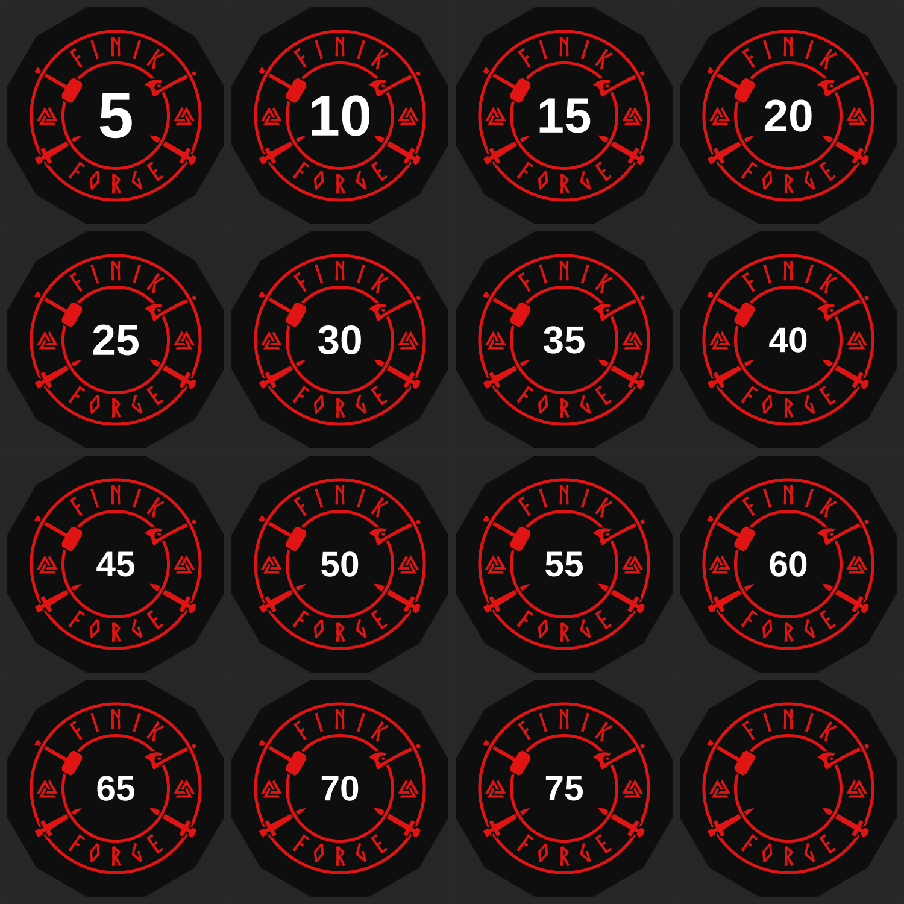

# FINIK FORGE

Generator for the **FINIK FORGE** home-gym dumbbell end-cap badges — laser-engrave-ready vector
plates (5–75 lb + blank), 12-sided (with a 10-sided variant in the builder). Each badge: a Norse
sigil — twin valknuts, four woven weapons (axe, Mjölnir, two swords), curved FINIK / FORGE lettering,
and the weight number — sized to the dumbbell head.



## Setup
```bash
pip install -r requirements.txt
# lettering uses vfonts/Viking-Bold.otf; the number uses system Liberation Sans Bold
#   (textpath.DEFAULT = /usr/share/fonts/truetype/liberation/LiberationSans-Bold.ttf)
```

## Regenerate everything
```bash
python3 gen_finik_forge.py            # BOTH variants -> ./output_12sided and ./output_10sided
python3 gen_finik_forge.py 12         # just 12-sided
python3 gen_finik_forge.py 10 mydir   # 10-sided -> ./mydir
```
Run from the repo root (`AXE_d.txt` is read from the working directory). 10- and 12-sided badges
share the same per-weight footprint (corner-to-corner = vendor head diameter), so both drop onto the
same dumbbell heads.

## Brand logo (wall art / t-shirt)
A standalone emblem (NOT a dumbbell badge): weapons in their original positions, a large valknut
centered, EST. / 2020 flanking it, FINIK / FORGE around, and NO dumbbell plate. It is RED fill only
with every weave gap a true transparent hole, so it prints clean on any shirt or wall color.
```bash
python3 gen_logo.py      # -> ./logo/  (svg master, transparent png, black demo, eps, ai, pdf)
```

## One badge at a time
```python
import badge as B
VF = 'vfonts/Viking-Bold.otf'
art = B.build_art('50', 184.0, sides=12, text_font=VF)            # colored artwork SVG (true-mm)
trc = B.trace(184.0, sides=12)                                    # engrave path (head_mm-independent; trace once per variant)
brn = B.build_burn('50', 184.0, sides=12, art=trc, text_font=VF)  # laser SVG (engrave-red / engrave-white / registration)
```
Pass `sides=10` for the decagon variant.

## Layout
```
badge.py            unified 10/12-sided builder (the brain)
gen_finik_forge.py  driver: full badge packages (10- & 12-sided), all formats -> ./output_Nsided
gen_logo.py         brand logo (wall/t-shirt): red-only, transparent weave holes -> ./logo
hammerbuild.py sword.py vk.py textpath.py   primitives (rings, weapons, valknut, text)
burn.py             legacy base burn (unused by badge.py; kept for reference)
AXE_d.txt           purchased bearded-axe path (read at import — must be in cwd)
vfonts/             Viking-Bold.otf (lettering) + alternates
output_12sided/     current 12-sided production package (build output; regenerable)
output_10sided/     current 10-sided production package
logo/               brand logo outputs (SVG + transparent PNG + EPS/AI/PDF + black demo)
```

## Design (locked)
- **Frame:** 12-sided dodecagon, vertices every 30° + 15° offset, weapons at tilt 30.
  (10-sided = decagon, tilt 36, whole design scaled 1.04.)
- **Weave:** axe + hammer = handle under outer ring, head over inner. Both swords = grip over outer
  ring, blade under inner; blades shortened (`sword_Lb=105`) so the grip crosses the ring.
- **Lettering:** Viking-Bold size 70; 12-sided FINIK ls=24 / FORGE ls=36 (widths matched ~75 mm).
- **Number:** bold sans, `num_font_mm=30` (em) → ~21 mm digit height, **constant** on every plate.
- **Colors:** RED `#E11414` = engrave / color-fill; BLACK `#0e0e0e` = bare plate; number white.

## Sizing (per-weight, vendor head-diameter table)
Each badge's **corner-to-corner** width = the vendor 12-sided head diameter; the square page
(across-flats) = head × cos15. Edit `VENDOR_IN` in `gen_finik_forge.py` to re-size.
Corner-to-corner: 5=104.8 · 10=117.5 · 15=136.6 · 20=149.2 · 25=155.6 · 30=165.1 · 35=174.7 ·
40–75 + blank = 190.5 mm. Content clears the edge by ~7.5 mm (5 lb) to ~17 mm (big plates).

## Weave gaps tuned for paint (do not regress)
Small plates bridged when paint-filled; widened so every weave channel clears ~0.8 mm at 5 lb while
bars stay ~1.1–1.4 mm:

| param | is | was | controls |
|---|---|---|---|
| `VK_GAP` | 16 | 8 | valknut weave (~0.82 mm @ 5 lb) |
| `CAS` | 9 | 6 | weapon casing — over-weave gaps (sword grips over outer, heads over inner) |
| `FIXX` | 7 | 6 | ring-fix eraser — under-weave gaps (handles under outer, blades under inner) |

Sharp corners where a weapon meets a ring taper to a point (~0.1–0.3 mm) — unavoidable; engraving
holds them, paint rounds slightly. Measure widths with the **median** along the medial axis, not a
low percentile (the tail is corners, not the channel).

## ⚠ Critical burn-trace fix (do not regress)
In `_mask()` the valknut **must** pass `gapcolor=GAP` (white). The mask is black-ink-on-white and is
contour-traced into the engrave path; with vk.group's default dark `gapcolor="#0e0e0e"` the weave
gaps vanish against the black ink and the three triangles **fuse into a blob** in every burn file.
```python
vleft = vk.group(INK, TL, gap=VK_GAP, gapcolor=GAP)   # GAP = '#fff'
```

## Output formats (per plate, all true-mm)
`artwork/` SVG · `pdf/` · `eps/` · `ai/` (PDF-compatible Illustrator) — colored badge.
`burn/` SVG (named layers) · `burn-eps/` · `burn-ai/` · `burn-pdf/` — laser layers
(engrave-red + engrave-white number + gray dashed registration; transparent). The number layer is
white: visible on a dark laser canvas (LightBurn); in Illustrator select-all or darken the artboard.

---
*Private repo: contains a purchased axe vector (`AXE_d.txt`) and the Viking-Bold font — check their
licenses before making this public or redistributing.*
